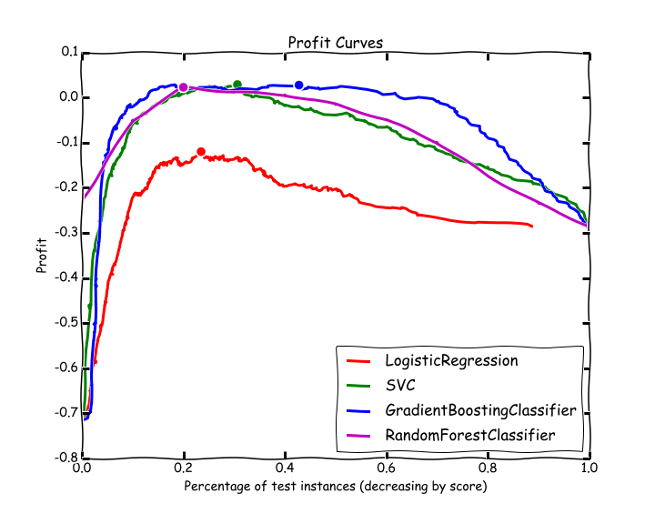
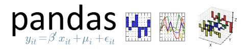

## Profit Curves and xkcd-style plotting

Sample data and and a cost benefit matrix are used to plot profit curves for various models and determine each model's optimum threshold for profit.

A sample churn dataset is stored in csv format and loaded into a pandas dataframe in python. Preliminary cleaning was then performed and the data were scaled.

A cost benefit matrix was created based on assumptions about the costs of a false positive (1), false negative (2), true positive (-1), and true negative (0).

Profit curves were generated and plotted using the probabilities predicted by each model and the TP, FP, TN, and FN rates for each probability threshold.

And THEN, I learned about making python plots look like xkcd cartoons. The final (and arguably most important) step was to generate the plot as an xkcd image.

